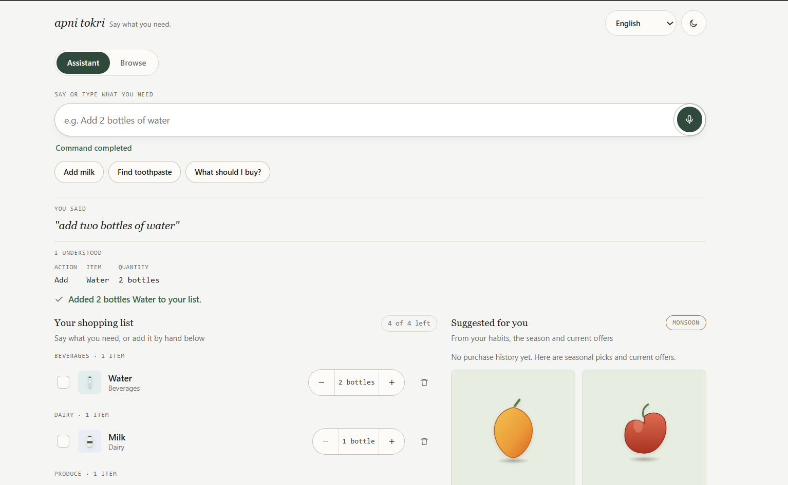
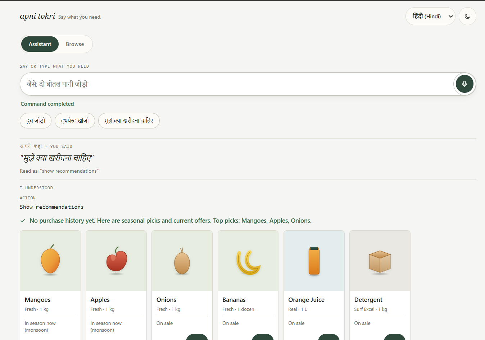
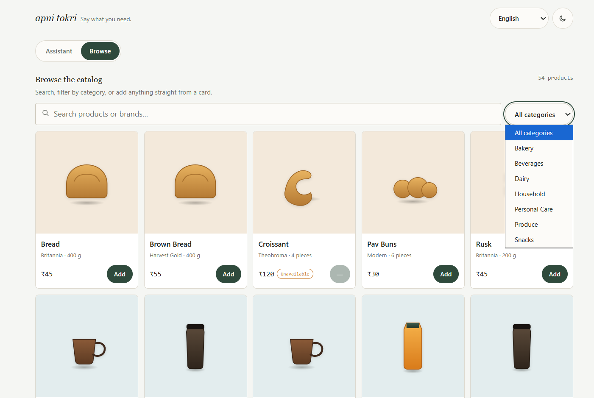
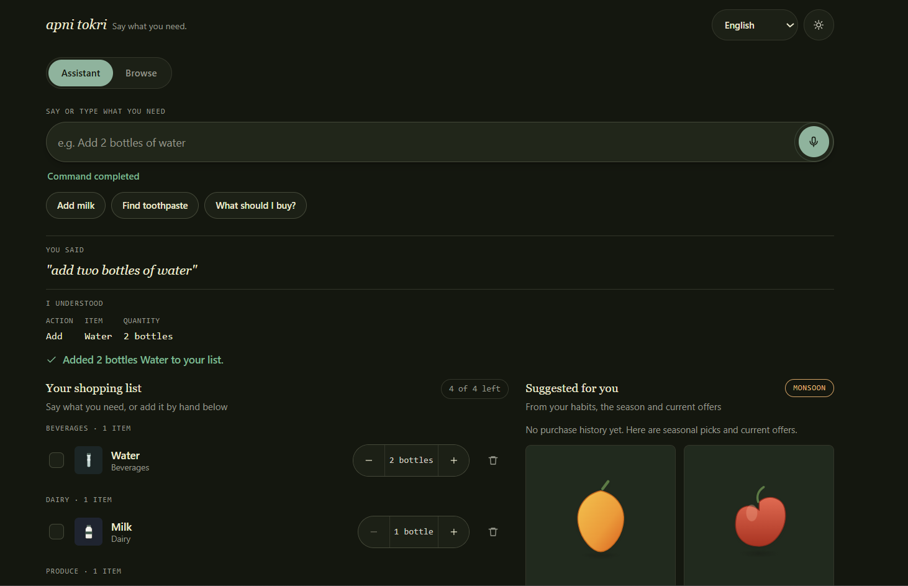
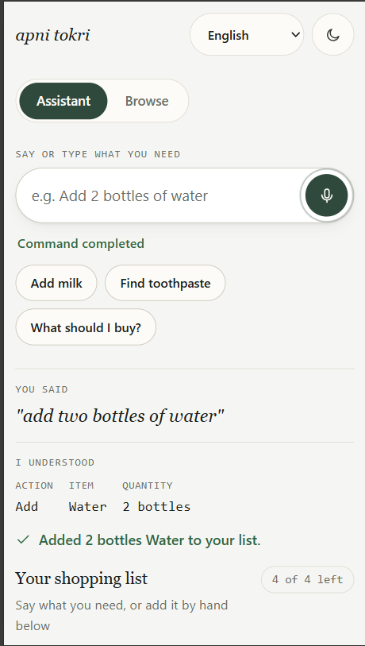
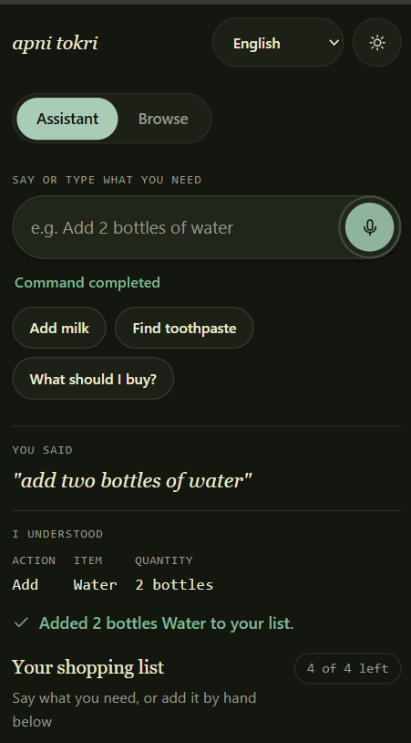

# Apni Tokri

"Apni Tokri" (अपनी टोकरी) — "your own basket."

*Say what you need.*

Apni Tokri is a voice-first shopping assistant for managing a grocery list
using natural-language commands in English or Hindi. You can speak or type "Add
two bottles of water," "Make milk three bottles," or "Find Colgate
toothpaste under 300," and it understands, confirms, and updates the list
accordingly.

## Live Demo

Try Apni Tokri here:

**[Live Demo](https://apni-tokri.onrender.com)**

---

## Purpose

Most shopping-list apps are designed mainly around typing and simple lists.
Apni Tokri focuses on three things:
natural spoken and typed input that can handle different phrasings, English
and Hindi support through the same parser, and recommendations that explain
why an item was suggested instead of simply showing a generic "suggested for
you" label.

---

## Key Features

- **Voice-first command bar**: one input handles both speech and typing.
  Idle, listening, processing, success, and error states are clearly shown.
- **Natural-language parsing**: a deterministic, rule-based parser with no
  LLM dependency understands varied phrasings such as "Add milk," "I need
  milk," "Can you add milk?," and "Make water 3 bottles."
- **English and Hindi**: Hindi commands are rewritten into their English
  equivalents and then passed through the same parser, so both languages use
  one pipeline.
- **Add / update / remove** shopping-list items by voice, typed command, or
  by hand, with quantity and unit handling ("2 bottles," "1 kg," "a dozen")
- **Voice-activated search** with brand, size, and price-range filtering:
  "Find Colgate toothpaste under 300"
- **Catalog browsing** with category filtering, separate from the primary
  Assistant flow
- **Recommendations with reasons**: a transparent additive score based on
  frequency, recency, category affinity, season, sale, and availability. Each
  recommendation also shows why it was selected.
- **Substitutes** offered automatically when a searched product is
  unavailable
- **Light and dark themes**, built from the same design tokens
- **Responsive, mobile-first layout** down to 360px, with 44×44px touch
  targets on every icon-only control
- **Local SQLite persistence**: no external database or account required

---

## Screenshots

### Assistant



A typed or spoken command ("add two bottles of water") shown through the
full pipeline: transcript, interpretation, confirmation, the updated list
grouped by category, and seasonal recommendations alongside it.

### Hindi & Recommendations



`मुझे क्या खरीदना चाहिए` is read as `show recommendations` and answered
with seasonal and on-sale picks: each labeled with the reason it was
suggested.

### Browse & Catalog



The secondary Browse view: the full catalog, category filtering, and an
unavailable product (Croissant) shown with its status instead of an active
Add button.

### Dark Mode



The same Assistant flow in the dark theme.

### Mobile

 

The Assistant view at mobile width, in both themes.

---

## Architecture

```
User
 ↓
React + Vite Frontend
 ↓
FastAPI REST API
 ↓
NLP / Command Parser (rule-based)
 ↓
SQLite Database
```

Voice capture is handled by the browser and is separate from the application
backend.

```
Browser Web Speech API
        ↓
   Voice transcript
        ↓
   Command parser (FastAPI)
        ↓
   SQLite
```

The backend never receives or processes audio: only the text transcript
the browser's speech engine produces. In Chrome and Edge, that transcription
happens via the browser vendor's own cloud speech service, not this
application; a typed command reaches the identical parser with no such
dependency.

In production, a single FastAPI process serves the API and the built React
application from one origin. The frontend therefore calls `/api/...` directly
without a separate production base URL or CORS setup.

---

## Technology Stack

**Frontend:** React 18, Vite, JavaScript/JSX, hand-written CSS, Web Speech API

**Backend:** Python, FastAPI, Uvicorn

**Database:** SQLite (Python's standard-library `sqlite3`, no ORM)

**Testing:** pytest

**Deployment:** Docker, Render

No LLM, no translation API, no paid speech service, no UI framework, no
icon or animation library, no external database.

---

## Backend / API Overview

| Method | Endpoint | Purpose |
| ------ | -------- | ------- |
| GET | `/api/health` | Service and database status |
| GET | `/api/products` | List products (`search`, `category`) |
| GET | `/api/products/search` | Filter by query, brand, size, price range |
| GET | `/api/products/{id}` | Single product |
| GET | `/api/products/{id}/substitutes` | Alternatives for a product |
| GET | `/api/categories` | Distinct catalog categories |
| GET | `/api/shopping-list` | Current shopping list |
| POST | `/api/shopping-list` | Add an item by product id or name |
| PATCH | `/api/shopping-list/{id}` | Update quantity, unit or completed state |
| DELETE | `/api/shopping-list/{id}` | Remove an item |
| POST | `/api/commands` | Interpret and run a voice or typed command |
| GET | `/api/recommendations` | Scored suggestions with reasons |

Interactive documentation is available at `/docs` when the backend is
running.

---

## Database

SQLite: a single local file, `backend/shopping.db`, created and seeded
with the 54-product catalog automatically on first start. There is no
PostgreSQL, MySQL, MongoDB, Supabase, or Firebase dependency, and no
database account of any kind is required. This is a local, single-instance
store suited to this assessment: not a production multi-user database. See
[Limitations](#limitations) for what that means when deployed to a
free-tier host.

---

## Project Structure

```
apni-tokri/
├── backend/
│   ├── main.py               # FastAPI app, routes, CORS, error handlers
│   ├── nlp.py                 # rule-based intent + entity parser
│   ├── hindi.py                # Devanagari → English command rewrite
│   ├── commands.py            # maps a parsed command to a service call
│   ├── services.py            # catalog + shopping-list SQL
│   ├── recommendations.py     # scoring engine
│   ├── database.py            # SQLite schema + seeding
│   ├── models.py              # Pydantic request/response models
│   ├── data/seed_products.json
│   ├── tests/                 # 102 pytest tests
│   └── requirements.txt
├── frontend/
│   ├── src/
│   │   ├── App.jsx
│   │   ├── api.js
│   │   ├── brand.js           # centralized product name/tagline
│   │   ├── tokens.css         # design tokens (light + dark)
│   │   ├── styles.css
│   │   ├── productImages.jsx  # product illustration system
│   │   ├── icons.jsx
│   │   ├── components/
│   │   └── hooks/useSpeechRecognition.js
│   └── package.json
├── docs/                      # current screenshots (used above)
├── Dockerfile
├── render.yaml
└── README.md
```

---

## Local Setup

Requirements: Python 3.10+ and Node.js 18+.

**Backend:**

```bash
cd backend
python -m pip install -r requirements.txt
python -m uvicorn main:app --reload --port 8000
```

The SQLite database is created and the catalog seeded automatically. No
environment variables are required.

**Frontend** (second terminal):

```bash
cd frontend
npm install
npm run dev
```

The frontend is served at the Vite development URL printed in the terminal
(typically `http://localhost:5173`), and proxies `/api` requests to the
backend on port 8000.

---

## Usage

Speak or type into the command bar: both reach the same pipeline:
**command → interpretation → confirmation → shopping list update.**

| Intent | Examples |
| ------ | -------- |
| Add | "Add two bottles of water" · "Can you add milk?" |
| Update | "Make milk three bottles" · "Change milk to 2 litres" |
| Remove | "Remove bananas" · "I don't need bananas anymore" |
| Search | "Find Colgate toothpaste under 300" |
| Suggest | "What should I buy?" |

Hindi (`hi-IN`): `दूध जोड़ो` ("add milk"), `पांच सेब जोड़ो` ("add 5
apples"), `दूध हटाओ` ("remove milk"), `मुझे क्या खरीदना चाहिए` ("show
recommendations"): each covered by an automated test and shown working in
the screenshots above.

---

## Testing

```bash
cd backend
pip install -r requirements.txt -r requirements-dev.txt
pytest tests/ -q
```

**102 tests passing** (verified against this repository before writing this
document), covering: rule-based NLP across varied English phrasings,
quantity/unit extraction, and malformed input; Hindi command normalization
end-to-end; the recommendation scoring function; and the full API surface
via FastAPI's `TestClient`, including validation errors and the full voice-
command pipeline in both languages.

`npm run build` was verified to complete cleanly against the current
frontend source.

---

## Deployment

The application is packaged as a single Docker image. A Node 20 build stage
creates the React production build, while a Python 3.11 stage runs Uvicorn and
serves the API and frontend from the same origin.

1. Push to GitHub.
2. Render → **New → Web Service** (or **New → Blueprint** using the
   `render.yaml` in this repository).
3. Runtime **Docker**, instance type **Free**.
4. No environment variables are required.

```bash
docker build -t apni-tokri .
docker run -p 8000:8000 apni-tokri
```

---

## Limitations

- **Browser Web Speech API behavior varies by browser and network.**
  Chrome and Edge support it; Firefox does not; iOS Safari is inconsistent.
  Chromium's implementation depends on connectivity to the browser vendor's
  own speech-recognition service to transcribe audio: this is a
  characteristic of the browser, not something this application controls.
  The typed command box provides every feature identically when voice is
  unavailable.
- **SQLite is local, not a managed production database.** On a free-tier
  host without persistent disk storage, the database file is recreated on
  restart or redeploy: the catalog reseeds automatically, but shopping-list
  and purchase-history changes made during a session do not survive it.
- **No accounts**: a deployment shares one shopping list across visitors.
- **Hindi support is dictionary-based**, bounded to the vocabulary in
  `backend/hindi.py`.
- **Product imagery** uses this project's own illustrated `ProductImage`
  system rather than licensed real-world product photography, which was not
  available to source or generate within this project's constraints. The
  component is deliberately isolated so real photography could replace it
  without changing any card, list, or catalog component.
- **Recommendation weights are hand-tuned**, not learned; there is no
  purchase-cycle/replenishment estimate, since the backend does not track
  individual purchase timestamps at the granularity that would require.

---

## Future Improvements

- A persistent production database, if the app moves beyond a single-
  instance assessment deployment
- Authenticated multi-user accounts and per-user shopping lists
- Richer, ideally licensed, product imagery
- Broader multilingual coverage beyond English and Hindi
- Improved speech-recognition resilience across browsers/networks
- A genuine replenishment/personalization model backed by purchase history
- Production-grade observability (logging, metrics, error tracking)

---
